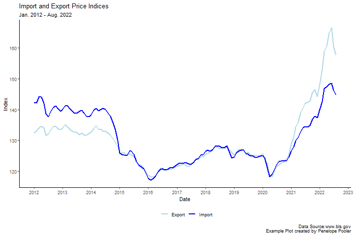

```{r setup, include=TRUE}

# this line specifies options for default options for all R Chunks
knitr::opts_chunk$set(echo=T, 
                      highlight=T)

# suppress scientific notation
options(scipen=100)

# install helper package (pacman), if needed
if (!require("pacman")) install.packages("pacman", repos = "http://lib.stat.cmu.edu/R/CRAN/")

# install and load required packages
# pacman should be first package in parentheses and then list others
pacman::p_load(pacman, tidyverse, magrittr, lubridate)

# verify packages (comment out in finished documents)
p_loaded()

```


---

### Comments About Quiz 1

- Grading is in progress, but can not be discussed until all grades are entered.

- I hope that all quizzes will be graded by this weekend.

<br>

### HW 4 is posted and is due next week on Wednesday, 2/28/23.

- We will work through it together on Thursday

- Demo Videos will be posted later this week.


---

#### R functions:

- Useful for automating repetitive, detailed, data management

Best Practices:

- Plan what you want to do 

  - Often useful to write out your planned tasks in english

- Develop and refine the code to complete your tasks
  
- Subdivide the larger tasks into smaller shorter tasks

- Convert each set of asks into a function

  - When in doubt, make the function more general and less specific so it is more useful
  
---

#### Anatomy of a Function (Option 1):

- Commands within function **are not saved** to an object.
- Function results are automatically 'kicked out' as output.

```
Function_Name <- function(input_1, input_2, etc){
   command 1 to do "stuff" to inputs |>
   command 2 to do "stuff" to inputs |>
   command 3 to do "stuff" to inputs |> etc. # output is autmatically "kicked out"
}

```
<br>

#### Anatomy of a Function (Option 2):

- Commands within function **are saved** to an object.
- Function must end with name of object so that results are 'kicked out' as output.


```
Function_Name <- function(input_1, input_2, etc){
   output <- command 1 to do "stuff" to inputs |>
             command 2 to do "stuff" to inputs |>
             command 3 to do "stuff" to inputs |> etc.
   output  # end with name of output so that it is "kicked out" of function
}


```

---


### Steps for Cleaning Box Office Management Data:

**`1.`** Import raw .csv file and skip header rows above variable names
- Examine .csv file to determine number of rows to skip

**`2.`** Select useful columns (Columns 1, 4, 7, and 9):

- 1: `Date` 
- 4: `Top 10 Gross` is a character variable with nuisance characters to be removed (`$` and `,`)
- 7: `Releases`
- 9: `Gross` is a character variable with nuisance characters to be removed (`$` and `,`)

**`3.`** Rename these four variables to easier names to work with in R

**`4.`** Remove non-data rows (Holidays and Covid Restriction Days)

**`5.`** Use `mutate` to convert variables to useable formats:

- Use `paste` to add year text to `date` character variable and convert to a date variable.
- Use `gsub` and `as.numeric` to convert each gross variable to numeric:
  
  - `gsub` is used to remove `$` and `,` 
  - `as.numeric` is used to convert character to numeric decimal value (`<dbl>`).


---

### Cleaning One Data Set:

```{r cleaning 1 bom dataset}

bom2021 <- read_csv("box_office_mojo_2021.csv", skip=10) |>
  select(1,4,7,9) |>
  rename("date" = "Date", 
         "top10gross" = "Top 10 Gross", 
         "num_releases" = "Releases",
         "num1gross" = "Gross") |>
  filter(!is.na(top10gross)) |>
  mutate(date = dmy(paste(date,2021)),
         top10gross = gsub(pattern="$", replacement="", x=top10gross, fixed=T),
         top10gross = gsub(pattern=",", replacement="", x=top10gross, fixed=T) |>
           as.numeric(),
         
         num1gross = gsub(pattern="$", replacement="", x=num1gross, fixed=T),
         num1gross = gsub(pattern=",", replacement="", x=num1gross, fixed=T) |>
           as.numeric()) |>
  glimpse()

```

---

### Converting Box Office Mojo Cleaning Code to a Function

```{r bom_cln_function}

bom_cln <- function(data_file, yr, skip_num){   # inputs: data_file is file name
                                                #         yr is year of data
                                                #         skip_num is number of header rows to skip
  
  read_csv(data_file, show_col_types = F, skip=skip_num) |>   # data_file and skip_num used here 
  select(1,4,7,9) |>                            # columns needed are always the same for bom
  rename("date" = "Date",                       # column renaming always the same
         "top10gross" = "Top 10 Gross", 
         "num_releases" = "Releases",
         "num1gross" = "Gross") |>
  filter(!is.na(top10gross)) |>                # filter out non-data rows
  mutate(date = dmy(paste(date,yr)),           # paste yr input to date text and convert to date
                                               
         top10gross = gsub(pattern="$", replacement="", x=top10gross, fixed=T),
         top10gross = gsub(pattern=",", replacement="", x=top10gross, fixed=T) |>
           as.numeric(),
         num1gross = gsub(pattern="$", replacement="", x=num1gross, fixed=T),
         num1gross = gsub(pattern=",", replacement="", x=num1gross, fixed=T) |>
           as.numeric()) 
}

```

---

### Working with Dates using `lubridate`

`lubridate` can convert a wide variety of text information to a date.  

- User must specify order of information, e.g. `ymd` indicates year, then month, the day

- Text must include year, but day is not required (See HW 4)


```{r examples of lubridate}
"1st of March, 2022"   # text date

dmy("1st of March, 2022")   # example of lubridate command dmy

paste("Hello", "Goodbye")   # example of paste

"February 28" # example of month and day only

paste("February", 2022)   # using paste to add year to month and day

my(paste("February", "2022"))   # using lubridate example with paste

"March 1st, 2022"   # different form of text date

ymd(20220401)   # example of lubridate command ymd 

Sys.Date()   #demo of Sys.date

```

---

### Week 6 In-class Exercises (Q1)

***Session ID: bua455s24***

What is the correct `lubridate` command to convert "March 1st, 2022" to a date value in R.

"March 1st, 2022"

**Hint:** Test out commands in console to see what the output is.

---

### Function Format Options

#### Option 1

- No objects are saved within function and result is `kicked out`
- Ideal for straightforward functions and plot functions

```{r option 1 for functions}

bom_cln <- function(data_file, yr, skip_num){   
  read_csv(data_file, show_col_types = F, skip=skip_num) |>   # data_file and skip_num used here 
  select(1,4,7,9) |>                            # columns needed are always the same for these datasets
  rename("date" = "Date",                       # column renaming always the same
         "top10gross" = "Top 10 Gross", 
         "num_releases" = "Releases",
         "num1gross" = "Gross") |>
  filter(!is.na(top10gross)) |>                # filter out non-data rows
  mutate(date = dmy(paste(date,yr)),           # paste yr input to date text and convert to date
         top10gross = gsub(pattern="$", replacement="", x=top10gross, fixed=T),
         top10gross = gsub(pattern=",", replacement="", x=top10gross, fixed=T) |>
           as.numeric(),
         num1gross = gsub(pattern="$", replacement="", x=num1gross, fixed=T),
         num1gross = gsub(pattern=",", replacement="", x=num1gross, fixed=T) |>
           as.numeric()) 
}
bom2018_Op1 <- bom_cln(data_file = "box_office_mojo_2018.csv", yr = 2018, skip_num=10) # use function

```


#### Option 2

- Commands within function are saved to an object, `d_out`
- Function ends with `d_out` so that result gets `kicked-out` of function

```{r option 2 for functions}
bom_cln <- function(data_file, yr, skip_num){   
  d_out <- read_csv(data_file, show_col_types = F, skip=skip_num) |>   # data_file and skip_num used here
    select(1,4,7,9) |>                            # columns needed are always the same for these datasets
    rename("date" = "Date",                       # column renaming always the same
           "top10gross" = "Top 10 Gross", 
           "num_releases" = "Releases",
           "num1gross" = "Gross") |>
    filter(!is.na(top10gross)) |>                # filter out non-data rows
    mutate(date = dmy(paste(date,yr)),           # paste yr input to date text and convert to date
           top10gross = gsub(pattern="$", replacement="", x=top10gross, fixed=T),
           top10gross = gsub(pattern=",", replacement="", x=top10gross, fixed=T) |>
             as.numeric(),
           num1gross = gsub(pattern="$", replacement="", x=num1gross, fixed=T),
           num1gross = gsub(pattern=",", replacement="", x=num1gross, fixed=T) |>
             as.numeric()) 
  d_out
}
bom2018_Op2 <- bom_cln(data_file = "box_office_mojo_2018.csv", yr = 2018, skip_num=10) # use function

```


#### Option 3

- This option has 1 more input, `out_file`, to export clean data using `write_csv`
- Useful for providing `clean` data to a client or colleague that doesn't use R
```{r option 3 for functions}
bom_cln_out <- function(data_file, yr, skip_num, out_file){   
    read_csv(data_file, show_col_types = F, skip=skip_num) |>   # data_file and skip_num used here 
    select(1,4,7,9) |>                            # columns needed are always the same for these datasets
    rename("date" = "Date",                       # column renaming always the same
           "top10gross" = "Top 10 Gross", 
           "num_releases" = "Releases",
           "num1gross" = "Gross") |>
    filter(!is.na(top10gross)) |>                # filter out non-data rows
    mutate(date = dmy(paste(date,yr)),           # paste yr input to date text and convert to date
           top10gross = gsub(pattern="$", replacement="", x=top10gross, fixed=T),
           top10gross = gsub(pattern=",", replacement="", x=top10gross, fixed=T) |>
             as.numeric(),
           num1gross = gsub(pattern="$", replacement="", x=num1gross, fixed=T),
           num1gross = gsub(pattern=",", replacement="", x=num1gross, fixed=T) |>
             as.numeric()) |>
    write_csv(out_file)
}
bom2018_Op3 <- bom_cln_out(data_file = "box_office_mojo_2018.csv", yr = 2018, skip_num=10, 
                       out_file = "box_office_mojo_2018_tidy.csv") # use function

```

---

### Week 6 In-class Exercises (Q2)

***Session ID: bua455s24***

When using Options, what output(s) is created?

A. A exported .csv file 
B. A clean tibble dataset saved to the Global Environment
C. Both an exported .csv file and a clean tibble dataset in R


---


### More Comments on Functions

- Even if a function works for one situation, it may not work for every situation.

- Published R functions are very long because they are tested and edited and retested to account for most situations.

- For example, you can examine the text for a function we have used

  - In the console, type `read_csv` without the parentheses and push `Enter`.
  
  - You can see the text of the function which is complex.
  
---

### Using our Function

Let's run Option 3, which cleans the data AND exports a cleaned(tidied) version

Note that there will be one error for 2020.

```{r testing our function}

bom2018<- bom_cln_out(data_file = "box_office_mojo_2018.csv", yr = 2018, skip_num=10, 
                       out_file = "box_office_mojo_2018_tidy.csv")

bom2019<- bom_cln_out(data_file = "box_office_mojo_2019.csv", yr = 2019, skip_num=10, 
                       out_file = "box_office_mojo_2019_tidy.csv")

bom2020<- bom_cln_out(data_file = "box_office_mojo_2020.csv", yr = 2020, skip_num=10, 
                       out_file = "box_office_mojo_2020_tidy.csv")

bom2021<- bom_cln_out(data_file = "box_office_mojo_2021.csv", yr = 2021, skip_num=10, 
                       out_file = "box_office_mojo_2021_tidy.csv")

# fix NA due to leapday manually
# not easily fixed within function
bom2020$date[is.na(bom2020$date)] <- dmy(29022020)
```

---

### Join datasets vertically (stacking)

- If you have multiple identical datasets with the same columns, you can 'stack' them using `bind_rows` command.

- **Recommended:** Import and format datasets to all have same column names so that this is seamless.

  - Functions are useful for creating identically formatted datasets.

```{r create one bom dataset}

# join datasets
bom_2018_2021 <- bind_rows(bom2018, bom2019, bom2020, bom2021)

# Modify gross variables (could also be done in function)
bom_2018_2021 <- bom_2018_2021 |>
  mutate(top10grossM = (top10gross/1000000) |> round(2), 
         num1grossM = (num1gross/1000000) |> round(2)) |>
  glimpse()

```

---

### HW 4 Preview

We will create a time series line plot from multiple years of data in class

In HW 4 you will use data from the [Bureau of Labor Statistics](https://www.bls.gov/) that is easier to clean

- Much of this code is review

- Useful plot formatting code:
  -   Move legend to bottom: `theme(legend.position="bottom")`
  
  -   Format scale of dates: `scale_x_date(date_breaks = "3 months", date_labels = "%b")`
  
      - In HW 4, you will use `date_breaks = "year", date_labels = "%Y"`
  
  -   Format all plot labels using a `labs` command

---

### Modify Data

Reshape data and create a factor variable with plot label text (Similar to Hw 4 - Part 4)

```{r modify data for lineplot}
bom_plot_data <- bom_2018_2021 |>
  select(date, top10grossM, num1grossM) |>
  pivot_longer(cols=top10grossM:num1grossM, names_to = "type", values_to="grossM") |>
  mutate(type=factor(type, 
                     levels=c("top10grossM", "num1grossM"), 
                     labels=c("Top 10", "No. 1"))) 
head(bom_plot_data)
```


### Basic Plot

```{r create basic line plot, fig.dim=c(15,5)}
(bom_ln_plot <- bom_plot_data |>
  ggplot() +
  geom_line(aes(x=date, y=grossM, color=type)) + 
  theme_classic())
```

### Legend & Lines

```{r modify legend and lines, fig.dim=c(15,5)}
(bom_ln_plot <- bom_plot_data |>
  ggplot() +
  geom_line(aes(x=date, y=grossM, color=type), size=0.75) + 
  theme_classic() +
  theme(legend.position="bottom") + 
  scale_color_manual(values=c("lightblue","blue")))
```


### X-axis & Labels

```{r modify labels and axis breaks, fig.dim=c(15,4.5)}
(bom_ln_plot  <- bom_ln_plot + 
  scale_x_date(date_breaks = "3 months",         # OG code for date_labels
                 date_labels = "%b") +
  labs(x="Date", y = "Gross ($Mill)", color="",  # modify plot labels
       title="Top 10 and No. 1 Movie Gross by Date", 
       subtitle="Jan. 1, 2018 - Dec. 31, 2021",
       caption="Data Source:www.boxoffice.mojo.com"))
```


### Text & Border

- Not required for HW 4

```{r modify text and borders, fig.dim=c(15,4)}
(bom_ln_plot  <- bom_ln_plot + 
     theme(plot.title = element_text(size = 20),
        plot.subtitle = element_text(size = 15),
        axis.title = element_text(size=18),
        axis.text = element_text(size=15),
        plot.caption = element_text(size = 10),
        legend.text = element_text(size = 12),
        panel.border = element_rect(colour = "lightgrey", fill=NA, size=2),
        plot.background = element_rect(colour = "darkgrey", fill=NA, size=2)))
```


### Complete Code

- Similar but more complex than complete plot code for HW 4.
- Additional formatting is required for slides
- HW 4 plot code will end with `labs` command.

```{r complete code}
bom_ln_plot <- bom_plot_data |>
  ggplot() +
  geom_line(aes(x=date, y=grossM, color=type), size=0.75) + 
  theme_classic() +
  theme(legend.position="bottom") +                               # position legend at bootom
  scale_color_manual(values=c("lightblue","blue")) +              # modify line colors
  scale_x_date(date_breaks = "3 months",  date_labels = "%b") +   # OG code for date_labels
  labs(x="Date", y = "Gross ($Mill)", color="",                   # modify plot labels
       title="Top 10 and No. 1 Movie Gross by Date", 
       subtitle="Jan. 1, 2018 - Dec. 31, 2021",
       caption="Data Source:www.boxoffice.mojo.com") + 
  theme(plot.title = element_text(size = 20),                     # text size and borders
        plot.subtitle = element_text(size = 15),
        axis.title = element_text(size=18),
        axis.text = element_text(size=15),
        plot.caption = element_text(size = 10),
        legend.text = element_text(size = 12),
        panel.border = element_rect(colour = "lightgrey", fill=NA, size=2),
        plot.background = element_rect(colour = "darkgrey", fill=NA, size=2))
```


---

### Final Formatted Line Plot

```{r final plot, echo = F, fig.dim=c(15,6)}
bom_ln_plot

```

---

### Bureau of Labor Statistics (BLS) Data

- Bureau of Labor Statistics is an excellent resource for economic data.

- Many (not all) BLS datasets have a similar format.

- In HW 4 you will:  

  - Create a function from code use to clean the monthly Unemployment Rate data, `bls_unemp_rate.csv`

  - Use this function to import two related data sets
    - **Export Price Index**
    - **Import Price Index**.
    
  - Join these two data-sets using a `full_join` and create a `date` variable
  
  - Modify the the data to create a formatted plot
  
  - Follow instructions to create a formatted final plot
  
    
-   Next week: We will adapt this function to examine labor force variables and create an area plot.

-   Recall: Before importing ANY data, **ALWAYS** examine the `.csv` file.

---

### HW 4 - Bureau of Labor Statistics Data

[Bureau of Labor Statistics](https://www.bls.gov/) is a great source for economic data.

In HW 4, we will look at three data sets:

- Unemployment Rate, the percentage of people unemployed (`bls_unemp_rate.csv`)

- Import Price Index (`bls_import_index.csv`)

- Export Price Index (`bls_export_index.csv`)

The Import and Export Price Indices contain data on changes in the prices of nonmilitary goods and services traded between the U.S. and the rest of the world.

- [Documentation on Import and Export Price Indixes](https://www.bls.gov/mxp/)

- [Additional Documention provided by Investopedia](https://www.investopedia.com/terms/i/import-export-prices.asp)

<br>

- Before going further, examine these three .csv files to determine number of header rows to skip when cleaning the data

---

### Introduction to Joins

Earlier today we discussed stacking datasets vertically.

We used `date` to stack the data.

Alternatively, we can join datasets Horizontally if they have matching variables with matching values.


#### **Types of Joins**

- Datasets are joined two at a time, then a third can be joined to first two.

- In BUA 455, we will cover four types of joins (but others exist):

  - `left_join`: include all observations in **FIRST** dataset in join command (dataset on left)

  - `right_join`: include all observations in **SECOND** dataset in join command (dataset on right)

  - `inner_join`: only include observations that are in **BOTH** datasets

  - `full_join`: include all observations that are in **EITHER** dataset


-   All joins are useful
-   I usually (not always) prefer using `full_join` to help in revealing data errors or discrepancies between multiple datasets.

---

### Quick note about R colors

-   There are [657 Colors in R](https://docs.google.com/spreadsheets/d/1m-UfG96DB4ZAOntVyzcjuYrX564AdLGB2f-MA6rvc2s/edit?usp=sharing)

- We'll talk more about color options and palettes, but it's good to know they exist.

- Although we don't emphasize data visualization theory in this course, you do have to visualize the data in a way that makes it understandable to a client.

- Choosing colors, symbols, size of text, size of lines, etc. wisely is an important part of data management and curation.

- As we transition to discussing the group projects (Next Week), we will start talking more about how to communicate with data effectively.
  - Color choices will be part of that discussion.

- For now, in HW 4 and today's demo, I manually choose colors so you can see how that works.

---

### Outline of HW 4

- First Steps

  - Create project and code_data_output folder
  - Save template and data to project
  
- Part 1

  - Create `bls_tidy` function from code used to import and clean `bls_unemp_rate.csv`
  - Run the function and then use it to import and clean `bls_unemp_rate.csv`
  
- Part 2

  - Use `bls_tidy` function to 
  
    - import and clean `bls_import_index.csv` and save it as `import_index` 
    - import and clean `bls_export_index.csv` and save it as `export_index`
  
- Part 3

  - Use full `full_join` to join `import_index` and `export_index` into one dataset, `export_import`
  - Use correct `lubridate` command and `paste` command to create a date variable
  
- Part 4

  - Reshape `export_import` dataset using `pivot_longer` to create `exp_imp_plt` that will be used to plot the data.
  - Type of index, `type` will be converted to a `factor` with levels and labels for the plot.
  
- Part 5

  - Create a formatted line plot with 
    - One line for the Export Price Index (light blue line)
    - One line for Import Price Index (light blue line)
    
- Final Steps

  - Answer all Blackboard Questions
  - Knit .Rmd file, 
  - Create README FOR HW 4
  - save all files correctly within HW 4 R Project
  - Zip and submit HW 4 R project
    
---

### Example of HW 4 Final Plot
**NOTES:**  

- Final HW 4 plot should be almost identical to the one below **EXCEPT** for second line of caption.
- Slides version has more formatting.  See version in `.html` lecture notes and HW 4 Instructions.


.center[

]

---

### **Key Points from Week 6**

**Developing Functions:**

- Develop code, convert to a function, test it

** Vertical and Horizontal Data Joins**

- Stack datasets vertically using `bind_rows`
- Join datasets horizontally by matching variables and values (**HW 4:** `full_join`)
  
**Working with date variables using `lubridate`**

- Command(s) to create date variables
- using `paste` to add year to text

**Next Week**

- More Examples from [BLS](https://www.bls.gov/)
- line and area plots, hcharts and dygraphs
- Converting between data formats 
  - `xts` and `tibble`
- Importing stock data from Yahoo Finance to R
- **Introducing the Group Project**

<br>

You may submit an 'Engagement Question' about each lecture until midnight on the day of the lecture. **A minimum of four submissions are required during the semester.**

